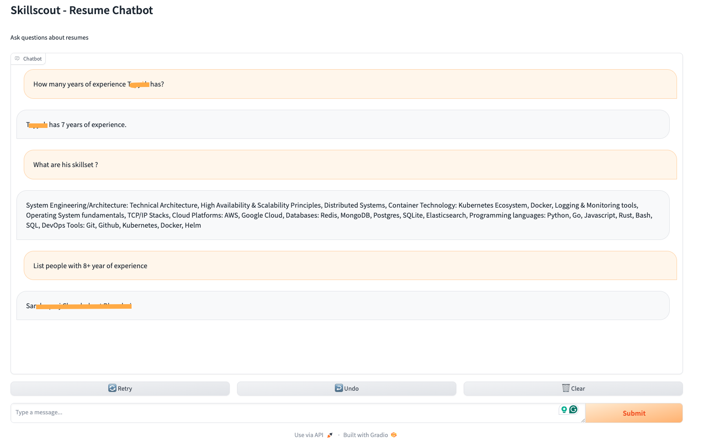

# SkillScout

Resume chatbot for internal purposes

## Usage

1. Install dependencies

    ```shell
    conda create --name skilscout-env python=3.11
    conda activate skilscout-env
    pip install -r requirements.txt
    ```

2. Source OpenAI API keys

    ```shell
    export OPENAI_API_KEY=<api_key>
    ```

3. Create a summary of all the resumes in the folder

    Store all the resume PDFs in the `data` folder and run the following command

    ```shell
    python app.py summarize --resume_path data
    ```

4. Create a vector store  of all summaries

    ```shell
    python app.py vector_store --resume_summary_path data
    ```

5. Run the app with the vector store

    ```shell
    python app.py app
    ```


